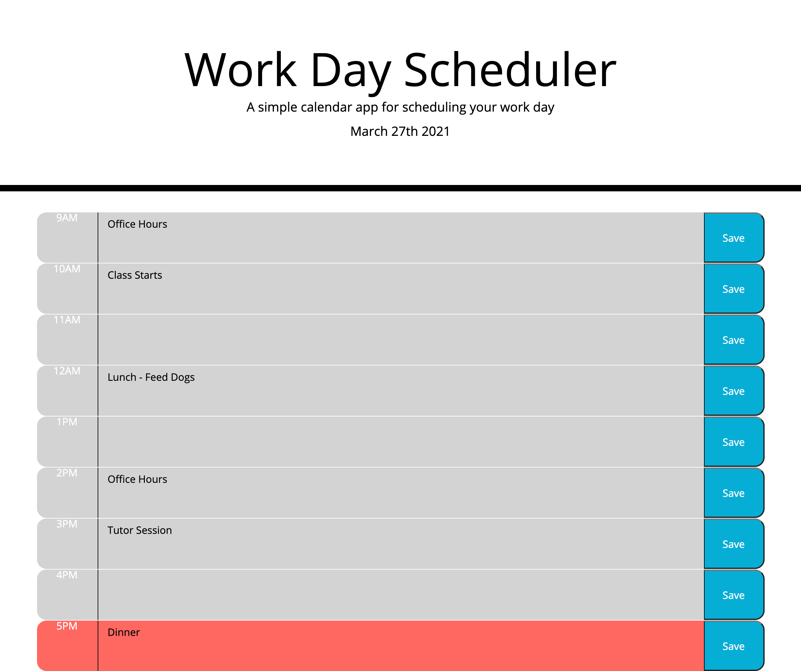

# Work Day Sceduler

## [Sceduler](https://josiemald.github.io/event-calendar/)

## [Repository](https://github.com/JosieMald/event-calendar)



### Project:
```
Client requested a daily planner to manage there time effectively due to a busy work schedule.
```

### Description
```
Created a daily planner that displays the current date with time blocks for each hour. Each time block is color coded to show whether it is in the past, present, or future. The client can adjust there schedule accordingly by typing in the text block and saving there input.
```